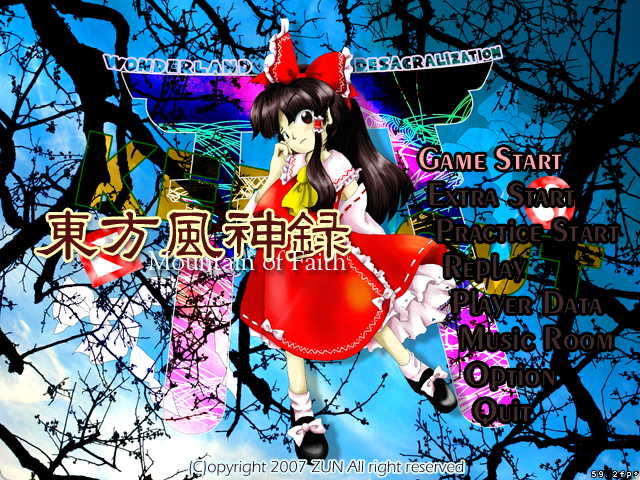
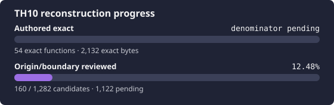

# 東方風神録 ～ Mountain of Faith

<p align="center">
  
</p>

<p align="center">
  
</p>

This project reconstructs the original Japanese TH10 version 1.00a executable.
It tracks target identity, candidate boundaries, origin, source presence,
codegen exactness, native-product closure, runtime semantics, and portability as
separate facts.

## Exact target

Supply your own legal copy at the ignored path `resources/th10.exe`.

| Property | Required value |
| --- | --- |
| Version | original Japanese 1.00a |
| Size | `487,936` bytes |
| SHA-256 | `2f14760b6fbbf57549541583283badb9a19a4222b90f0a146d5aa17f01dc9040` |
| MD5 | `7dc488d82c81dd4aee4ba098b8804d83` |
| Image base | `0x00400000` |
| Entry point | `0x004537DC` |

The pinned [thcrap version database](https://github.com/thpatch/thcrap-tsa/blob/f08b582ce57bce800955dd371fc9a68dbad5b324/base_tsa/versions.js)
classifies this exact SHA-256 as `th10`, `v1.00a`, `(original)`; patched
and Steam executables have different digests.

```bash
scripts/repo-python scripts/verify-target.py
scripts/repo-python scripts/validate-tracking.py --require-target
scripts/repo-python scripts/report-reconstruction-status.py
```

Original executables, game data, Ghidra projects, decompiler output, and
downloaded tools are private and never committed.

## Current status

The tracked function candidates have reviewed boundaries and origins, but some
origins remain indeterminate and unresolved `.text` gaps can still change the
inventory. Maintained source and canonical exact units are tracked separately;
see the generated [`docs/PROGRESS.md`](docs/PROGRESS.md) for live counts. The
whole Windows i386 build graph is still open, and semantic reconstruction and
portability have not started.

After changing a function, origin, mapping, implementation, or match ledger,
regenerate the committed progress artifacts before committing. Public CI checks
both `docs/PROGRESS.md` and `resources/progress.svg` against the current ledgers.

```bash
scripts/repo-python scripts/progress.py
scripts/repo-python scripts/ci.py
```

The repository pins a VC7.1 SP1 candidate reporting compiler/linker build 6030
and provides a headless-Wine verifier. Its smoke covers normal C/C++ COFF, C++
LTCG, resources, and a PE32 link. Target Rich records independently show 131
normal C, 15 normal C++, and 52 LTCG C++ inputs. Accepted exact units bind their
own compiler contexts; production translation-unit partition, libraries,
resources, data owners, and link order remain open.

Use `scripts/repo-python` for repository Python commands. It selects an
interpreter only when its Capstone package matches all four hashes in
`config/tools.lock.toml`; this avoids the system Python/Conda decoder mismatch
in Web shells without changing the decoder lock. A Factory shell may expose the
ignored `.tools/capstone` Python-package root; the wrapper prepends that root
only for a candidate execution and still verifies the same four locked files
before running the requested command.

```bash
scripts/repo-python scripts/verify-toolchain.py --execute
scripts/repo-python scripts/build-match-unit.py --check
scripts/repo-python scripts/report-source-completeness.py --module AnmManager --require-complete
scripts/repo-python scripts/report-exact-backlog.py
scripts/repo-python scripts/rank-exact-backlog.py --source src/PbgArchive.cpp
scripts/repo-python scripts/probe-exact-backlog.py --source src/PbgArchive.cpp
scripts/repo-python scripts/probe-ltcg-backlog.py --source src/PbgArchive.cpp
scripts/repo-python scripts/probe-ltcg-backlog.py --source src/AnmManager.cpp \
  --entry src/AnmManager.cpp=AsciiManagerCreate
scripts/repo-python scripts/replay-exact-units.py
```

Canonical units that share one source, compiler profile, and artifact context
are built once. The replay command cold-builds each normal-COFF object or LTCG
linked image and checks every selected function against the target. COFF units
declare relocations; linked-PE units declare every link-resolved code field.

The linked LTCG probe derives function extents from the linker's PDB section
contributions and reports structural candidates without granting exactness.
Reviewed `artifact_kind = "linked-pe"` units use a separate fail-closed
comparator that verifies PE/map/PDB identity, requires a complete PDB-owned
extent, exhaustively enumerates link-resolved fields, and replays them against
the target. This proves only the declared bounded unit; the incomplete harness
is not a reconstructed product.
The executable tool payload is shared and ignored; its 32-bit Wine prefix is
game-bound, ignored, and always driven through Xvfb. A normal-COFF function
comparison cannot establish an LTCG-owned function. See
[`docs/TOOLS.md`](docs/TOOLS.md) and [`docs/ORACLES.md`](docs/ORACLES.md).

## Required phase order

1. Reconcile authored boundaries and recover exact historical-toolchain units.
2. Close and exercise the faithful Windows i386 product, including data owners,
   initializers, resources, libraries, and runtime scenarios.
3. Perform semantic reconstruction using both the original target and the
   reconstructed native i386 product as runtime Oracles.
4. Start portability only after the native semantic baseline is trustworthy.

## Project map

- [`AGENTS.md`](AGENTS.md) — mandatory session and evidence rules.
- [`config/target.toml`](config/target.toml) — target and observed PE facts.
- [`config/build.toml`](config/build.toml) — explicit open whole-build graph.
- [`config/tools.lock.toml`](config/tools.lock.toml) — compiler, linker,
  frontend, optimizer, resource-tool, linked-code decoder, and headless-Wine
  lock.
- [`docs/RE_WORKFLOW.md`](docs/RE_WORKFLOW.md) — reconstruction loop and gates.
- [`docs/ORACLES.md`](docs/ORACLES.md) — claim-specific falsification rules.
- [`docs/RE_HANDOFF.md`](docs/RE_HANDOFF.md) — current state and next work.
- [`docs/KNOWLEDGE_BASE.md`](docs/KNOWLEDGE_BASE.md) — TH10-only knowledge.
- [Touhou Reconstruction Factory](https://github.com/N0zoM1z0/touhou-reconstruction-factory) — shared ontology and workflow.

## License

Repository-authored code and documentation are provided under the MIT License.
This does not grant rights to the original game or its assets.
